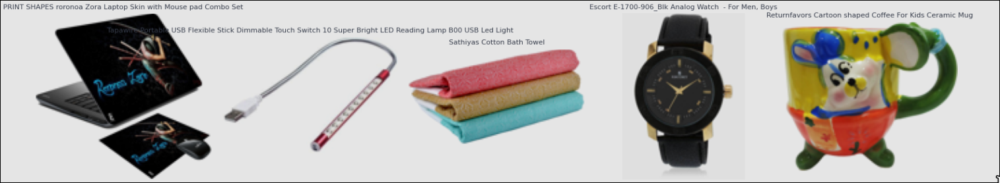
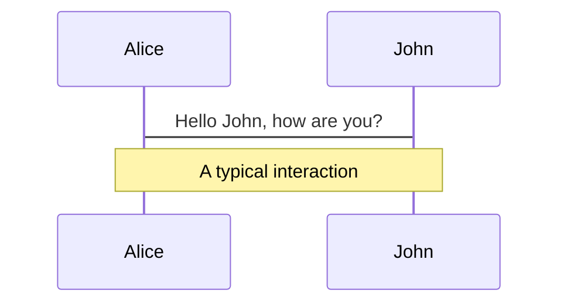
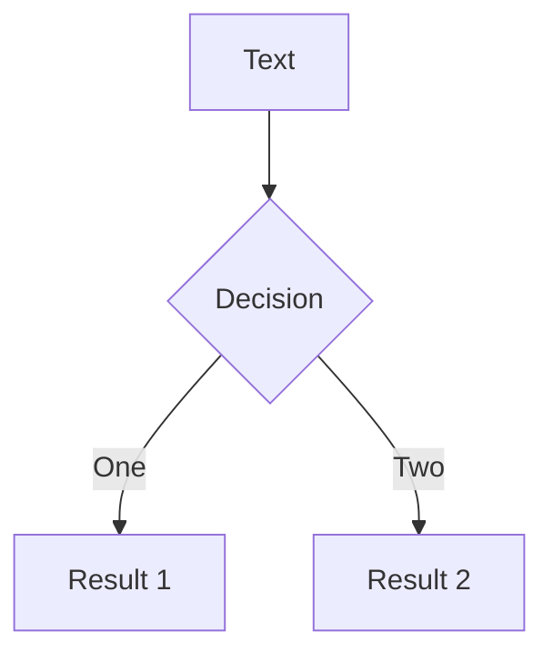
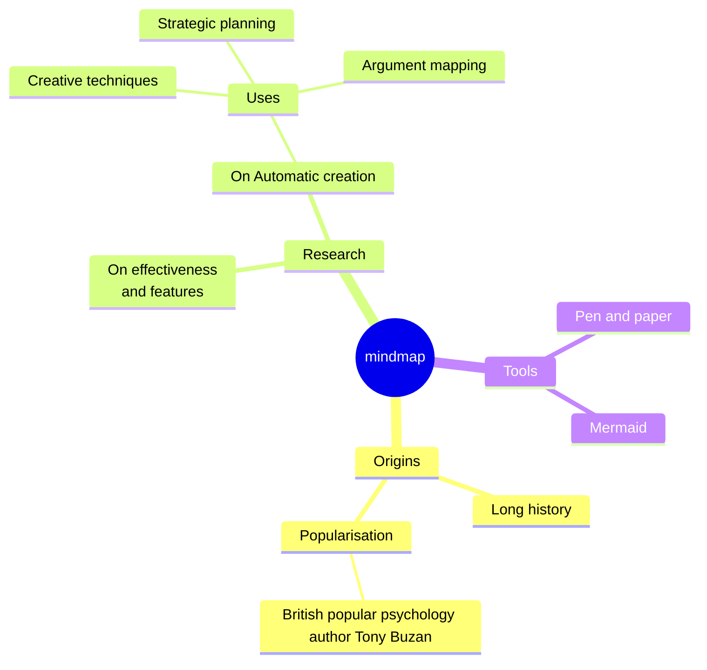
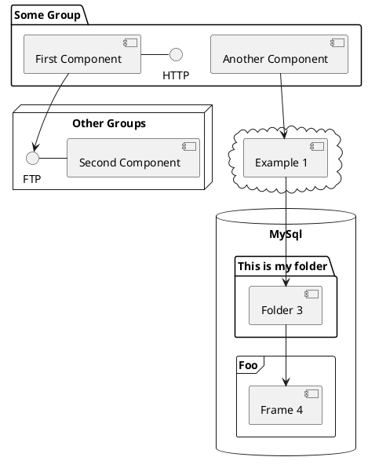

---
# You can also start simply with 'default'
theme: seriph
<<<<<<< HEAD
addons:
  - tldraw
  - slidev-addon-excalidraw
=======

>>>>>>> refs/remotes/upstream/master
# some information about your slides (markdown enabled)
title: Projet Openclassrooms 6
info: |
  ## Slidev Starter Template
  Presentation slides for developers.

  Learn more at [Sli.dev](https://sli.dev)
# apply unocss classes to the current slide
class: text-center
# https://sli.dev/features/drawing
drawings:
  persist: false
# slide transition: https://sli.dev/guide/animations.html#slide-transitions
transition: slide-left
# enable MDC Syntax: https://sli.dev/features/mdc
mdc: true
# take snapshot for each slide in the overview
overviewSnapshots: true
hideInToc: true
---

# Projet 6 Openclassrooms

<<<<<<< HEAD
Classifiez automatiquement des biens de consommation
=======
Segmentation Client d'un site de e-commerce
>>>>>>> refs/remotes/upstream/master

<div class="abs-br m-6 flex gap-2">
  <a href="https://openclassrooms.com/fr/projects/1502/mission---segmentez-des-clients-d'un-site-e-commerce" target="_blank" alt="OpenClassrooms" title="OpenClassrooms"
     class="text-xl slidev-icon-btn opacity-50 !border-none !hover:text-white">
    
  </a>
<<<<<<< HEAD
  <a href="https://github.com/dimitri-feniou/openclassrooms-projet6-classification-conso" target="_blank" alt="GitHub" title="Open in GitHub"
=======
  <a href="https://github.com/dimitri-feniou/openclassrooms-projet5-segmentation-olist" target="_blank" alt="GitHub" title="Open in GitHub"
>>>>>>> refs/remotes/upstream/master
     class="text-xl slidev-icon-btn opacity-50 !border-none !hover:text-white">
    <carbon-logo-github />
  </a>
</div>

<!--
The last comment block of each slide will be treated as slide notes. It will be visible and editable in Presenter Mode along with the slide. [Read more in the docs](https://sli.dev/guide/syntax.html#notes)
-->
<<<<<<< HEAD
---
transition: fade-out
layout: cover
---
# _I. Présentation du contexte projet et du jeu de données_


=======
>>>>>>> refs/remotes/upstream/master

---
transition: fade-out
---

<<<<<<< HEAD
# Contexte Projet

- L'entreprise **Place de marché** souhaite lancer une markeplace e-commerce
- **Problématique:** actuellement l'attribution de la catégorie du produit est effectuée manuellement par le vendeur, et est donc peu fiable.

<div class="flex items-center gap-4">
  <div class="encart-dark flex-1">
  <strong>Notre mission :</strong><br>
  <strong>Faire une étude de faisabilité d'un moteur de classification pour l'automatisation de l'attribution de la catégorie de l'article</strong> en fonction de la description et de l'image de l'article.
</div>

  
</div>

<div class="abs-br m-6 flex gap-2">
  <a href="https://openclassrooms.com/fr/projects/1502/mission---segmentez-des-clients-d'un-site-e-commerce" target="_blank" alt="OpenClassrooms" title="OpenClassrooms"
     class="text-xl slidev-icon-btn opacity-50 !border-none !hover:text-white">
    
  </a>
  <a href="https://github.com/dimitri-feniou/openclassrooms-projet6-classification-conso" target="_blank" alt="GitHub" title="Open in GitHub"
     class="text-xl slidev-icon-btn opacity-50 !border-none !hover:text-white">
    <carbon-logo-github />
  </a>
</div>
=======
# What is Slidev?

Slidev is a slides maker and presenter designed for developers, consist of the following features

- 📝 **Text-based** - focus on the content with Markdown, and then style them later
- 🎨 **Themable** - themes can be shared and re-used as npm packages
- 🧑‍💻 **Developer Friendly** - code highlighting, live coding with autocompletion
- 🤹 **Interactive** - embed Vue components to enhance your expressions
- 🎥 **Recording** - built-in recording and camera view
- 📤 **Portable** - export to PDF, PPTX, PNGs, or even a hostable SPA
- 🛠 **Hackable** - virtually anything that's possible on a webpage is possible in Slidev
<br>
<br>

Read more about [Why Slidev?](https://sli.dev/guide/why)

<!--
You can have `style` tag in markdown to override the style for the current page.
Learn more: https://sli.dev/features/slide-scope-style
-->
>>>>>>> refs/remotes/upstream/master

<style>
h1 {
  background-color: #2B90B6;
<<<<<<< HEAD
=======
  background-image: linear-gradient(45deg, #4EC5D4 10%, #146b8c 20%);
  background-size: 100%;
>>>>>>> refs/remotes/upstream/master
  -webkit-background-clip: text;
  -moz-background-clip: text;
  -webkit-text-fill-color: transparent;
  -moz-text-fill-color: transparent;
}
<<<<<<< HEAD
.encart-dark {
  border: 2px solid #ffffff; /* Bordure blanche pour contraster avec le fond sombre */
  padding: 15px;
  border-radius: 8px;
  font-weight: bold;
  background-color: #333333; /* Fond gris foncé pour s'harmoniser avec le mode sombre */
  color: #ffffff; /* Texte blanc pour une meilleure lisibilité */
  box-shadow: 0 4px 8px rgba(0, 0, 0, 0.5); /* Ombre portée pour donner de la profondeur */
  margin: 20px 0; /* Espacement vertical pour aérer le contenu */
}
=======
>>>>>>> refs/remotes/upstream/master
</style>

<!--
Here is another comment.
-->

---
<<<<<<< HEAD
transition: fade-out
zoom: 0.5
---

# Présentation du jeu de données 

<div class="encart-dark flex-1">
  <strong>Fichier CSV</strong>
  <ul>
    <li><strong>1050 lignes</strong> contenant des articles.</li>
    <li><strong>15 colonnes</strong> fournissant des informations sur chaque produit :</li>
    <ul>
      <li>Identifiant unique du produit</li>
      <li><strong>Nom du produit</strong></li>
      <li>Marque du produit</li>
      <li>URL du produit</li>
      <li><strong>Arborescence de la catégorie du produit (7 niveaux)</strong></li>
      <li>Prix</li>
      <li><strong>Description du produit</strong></li>
      <li><strong>Nom de l'image</strong></li>
    </ul>
  </ul>
  <p><strong>Nettoyage des données :</strong> Très peu de données manquantes, aucune absence dans les champs utilisés.</p>
</div>
<div class="encart-dark flex-1">
  <strong>Dossier d'images</strong>
  <ul>
    <li>Vérification de la corruption et du format des images</li>
  </ul>
   <div class="flex items-center justify-center mt-4">
   <strong>1050 image pour chaque produit</strong>
  </div>
  <div class="flex items-center justify-center mt-4">
    
  </div>
</div>


<style>
.encart-dark {
  border: 2px solid #ffffff;
  padding: 15px;
  border-radius: 8px;
  background-color: #333333;
  color: #ffffff;
  box-shadow: 0 4px 8px rgba(0, 0, 0, 0.5);
  margin: 20px 0;
}

.flex {
  display: flex;
}

.flex-1 {
  flex: 1;
}

.items-center {
  align-items: center;
}

.justify-center {
  justify-content: center;
}

.mt-4 {
  margin-top: 1rem;
}

.w-12 {
  width: 80%;
}

.h-auto {
  height: auto;
}
</style>

---
transition: fade-out
layout: cover
---
# _II.Présentation des approches de modélisation de classification et résultats_

---
transition: fade-out
---

# Approche de modélisation 

<div class="flex items-left justify-left mt-4">
    
</div>

<style>
h1 {
  background-color: #2B90B6;
  -webkit-background-clip: text;
  -moz-background-clip: text;
  -webkit-text-fill-color: transparent;
  -moz-text-fill-color: transparent;
}
.encart-dark {
  border: 2px solid #ffffff; /* Bordure blanche pour contraster avec le fond sombre */
  padding: 15px;
  border-radius: 8px;
  font-weight: bold;
  background-color: #333333; /* Fond gris foncé pour s'harmoniser avec le mode sombre */
  color: #ffffff; /* Texte blanc pour une meilleure lisibilité */
  box-shadow: 0 4px 8px rgba(0, 0, 0, 0.5); /* Ombre portée pour donner de la profondeur */
  margin: 20px 0; /* Espacement vertical pour aérer le contenu */
}
</style>

---
transition: fade-out
---
# Approche de modélisation générale

<div class="flex items-left justify-left mt-4">
    
</div>

<style>
h1 {
  background-color: #2B90B6;
  -webkit-background-clip: text;
  -moz-background-clip: text;
  -webkit-text-fill-color: transparent;
  -moz-text-fill-color: transparent;
}
.encart-dark {
  border: 2px solid #ffffff; /* Bordure blanche pour contraster avec le fond sombre */
  padding: 15px;
  border-radius: 8px;
  font-weight: bold;
  background-color: #333333; /* Fond gris foncé pour s'harmoniser avec le mode sombre */
  color: #ffffff; /* Texte blanc pour une meilleure lisibilité */
  box-shadow: 0 4px 8px rgba(0, 0, 0, 0.5); /* Ombre portée pour donner de la profondeur */
  margin: 20px 0; /* Espacement vertical pour aérer le contenu */
}
</style>

---
transition: fade-out
layout: cover
---
# _III.Présentation des approches de modélisation de classification du Texte_

---
transition: fade-out
---

# Traitement des données textuelles
Nettoyage des données textuelles

- Normalisation du texte sur le texte `product_name` et `description`:

1. Conversion du texte en minuscules et suppression de la ponctuation 

2. Tokenisation : Division du texte par mots

3.  Suppression des stopwords (articles,pronoms...)

4. Ajout du texte `product_name` et `description` dans la même phrase 


<style>
.encart-dark {
  border: 2px solid #ffffff;
  padding: 15px;
  border-radius: 8px;
  background-color: #333333;
  color: #ffffff;
  box-shadow: 0 4px 8px rgba(0, 0, 0, 0.5);
  margin: 20px 0;
}

.flex {
  display: flex;
}

.flex-1 {
  flex: 1;
}

.items-center {
  align-items: center;
}

.justify-center {
  justify-content: center;
}

.mt-4 {
  margin-top: 1rem;
}

.w-12 {
  width: 80%;
}

.h-auto {
  height: auto;
}
</style>

---
transition: fade-out
zoom: 0.7
---

# Approche Bag of words : comptage simple

- Représentation de chaque document en **fonction de la fréquence des mots** (count vectorizer)
- Création d'un vecteur pour chaque document rassemblé dans une **matrice de comptage**


<div class="flex items-left justify-left mt-4">
  <div style="display: flex; gap: 20px;">
    
    
  </div>
</div>
<div class="encart-dark flex-1 encart-centered">
  Score ARI : 0.3347 Séparation partielle des catégories
</div>

<style>
.encart-dark {
  border: 2px solid #ffffff;
  padding: 15px;
  border-radius: 8px;
  background-color: #333333;
  color: #ffffff;
  box-shadow: 0 4px 8px rgba(0, 0, 0, 0.5);
  margin: 20px 0;
  max-width: 500px; /* Limite la largeur de l'encart */
}

/* Centre l'encart en définissant une marge automatique */
.encart-centered {
  margin-left: auto;
  margin-right: auto;
}

/* Centrer les images */
.flex {
  display: flex;
  align-items: center;
  justify-content: center;
}
</style>

---
transition: fade-out
zoom: 0.6
---

# Approche Bag of words : TF-IDF (Term Frequency-Inverse Document Frequency)

- TF (Term Frequency) : Fréquence d'un mot dans le document
- IDF (Inverse Document Frequency) : Réduit l'importance des mots communs qui apparaissent dans de nombreux documents.


<div class="flex items-left justify-left mt-4">
  <div style="display: flex; gap: 20px;">
    
    
  </div>
</div>
<div class="encart-dark flex-1 encart-centered">
  Score ARI : 0.4092 Assez bonne séparation des catégories
</div>

<style>
.encart-dark {
  border: 2px solid #ffffff;
  padding: 15px;
  border-radius: 8px;
  background-color: #333333;
  color: #ffffff;
  box-shadow: 0 4px 8px rgba(0, 0, 0, 0.5);
  margin: 20px 0;
  max-width: 500px; /* Limite la largeur de l'encart */
}

/* Centre l'encart en définissant une marge automatique */
.encart-centered {
  margin-left: auto;
  margin-right: auto;
}

/* Centrer les images */
.flex {
  display: flex;
  align-items: center;
  justify-content: center;
}
</style>

---
transition: fade-out
zoom: 0.8
---

# Approche Bag of words : Word2Vec

- Word2Vec transforme chaque mot d'un texte en un vecteur de nombres, capturant des **caractéristiques sémantiques**.
- **similarité sémantique** : Les mots ayant des contextes similaires se retrouvent proches dans l'espace vectoriel


<div class="flex items-left justify-left mt-4">
  <div style="display: flex; gap: 20px;">
    
    
  </div>
</div>
<div class="encart-dark flex-1 encart-centered">
  Score ARI : 0.4364 Assez bonne séparation des catégories
</div>

<style>
.encart-dark {
  border: 2px solid #ffffff;
  padding: 15px;
  border-radius: 8px;
  background-color: #333333;
  color: #ffffff;
  box-shadow: 0 4px 8px rgba(0, 0, 0, 0.5);
  margin: 20px 0;
  max-width: 500px; /* Limite la largeur de l'encart */
}

/* Centre l'encart en définissant une marge automatique */
.encart-centered {
  margin-left: auto;
  margin-right: auto;
}

/* Centrer les images */
.flex {
  display: flex;
  align-items: center;
  justify-content: center;
}
</style>

---
transition: fade-out
zoom: 0.8
---

# Approche Bag of words : BERT  (Bidirectional Encoder Representations from Transformers)

- Réseau de neuronne pré-entrainé basé sur l'architecture transformers
- **Pré-entraînement bidirectionnel** : BERT apprend le contexte des mots à la fois avant et après chaque mot.Ce qui permet de mieux capture le contexte et sens des phrase.


<div class="flex items-left justify-left mt-4">
  <div style="display: flex; gap: 20px;">
    
    
  </div>
</div>
<div class="encart-dark flex-1 encart-centered">
  Score ARI : 0.3251 Séparation partielle des catégories
</div>

<style>
.encart-dark {
  border: 2px solid #ffffff;
  padding: 15px;
  border-radius: 8px;
  background-color: #333333;
  color: #ffffff;
  box-shadow: 0 4px 8px rgba(0, 0, 0, 0.5);
  margin: 20px 0;
  max-width: 500px; /* Limite la largeur de l'encart */
}

/* Centre l'encart en définissant une marge automatique */
.encart-centered {
  margin-left: auto;
  margin-right: auto;
}

/* Centrer les images */
.flex {
  display: flex;
  align-items: center;
  justify-content: center;
}
</style>

---
transition: fade-out
zoom: 0.8
---

# Approche Bag of words : USE  (Universal Sentence Encoder)

- USE produit une représentation vectorielle dense de chaque phrase 
- **Représentation sémantique** : Les vecteurs produits par USE sont créés pour que les phrases similaires (sémantiquement proches) aient des vecteurs proches dans l’espace vectoriel.

<div class="flex items-left justify-left mt-4">
  <div style="display: flex; gap: 20px;">
    
    
  </div>
</div>
<div class="encart-dark flex-1 encart-centered">
  Score ARI : 0.5122 Bonne séparation des catégories
</div>

<style>
.encart-dark {
  border: 2px solid #ffffff;
  padding: 15px;
  border-radius: 8px;
  background-color: #333333;
  color: #ffffff;
  box-shadow: 0 4px 8px rgba(0, 0, 0, 0.5);
  margin: 20px 0;
  max-width: 500px; /* Limite la largeur de l'encart */
}

/* Centre l'encart en définissant une marge automatique */
.encart-centered {
  margin-left: auto;
  margin-right: auto;
}

/* Centrer les images */
.flex {
  display: flex;
  align-items: center;
  justify-content: center;
}
</style>

---
transition: fade-out
layout: cover
---
# _III.Présentation des approches de modélisation de classification des images_


---
transition: fade-out
zoom: 0.8
---

# Approche SIFT

- **SIFT** : alorithme du domaine de la vision par ordinateur de reconnaissance de caractéristiques(feature détection).Il permet de **détecter et d'extraire des descripteurs de points clés dans une image** (bord,contours et point d'intérêt)qui sont invariant aux variations d'échelle et à la rotation.


<div class="flex items-left justify-left mt-4">
  <div style="display: flex; gap: 20px;">
    
  </div>
</div>


<style>
.encart-dark {
  border: 2px solid #ffffff;
  padding: 15px;
  border-radius: 8px;
  background-color: #333333;
  color: #ffffff;
  box-shadow: 0 4px 8px rgba(0, 0, 0, 0.5);
  margin: 20px 0;
  max-width: 500px; /* Limite la largeur de l'encart */
}

/* Centre l'encart en définissant une marge automatique */
.encart-centered {
  margin-left: auto;
  margin-right: auto;
}

/* Centrer les images */
.flex {
  display: flex;
  align-items: center;
  justify-content: center;
}
</style>


---
transition: fade-out
zoom: 0.8
---

# Approche Bag of words : SIFT  (Bidirectional Encoder Representations from Transformers)


<div class="flex items-left justify-left mt-4">
  <div style="display: flex; gap: 20px;">
    
    
  </div>
</div>
<div class="encart-dark flex-1 encart-centered">
  Score ARI : 0.04989 SIFT ne permet pas la séparation des catégories
</div>

<style>
.encart-dark {
  border: 2px solid #ffffff;
  padding: 15px;
  border-radius: 8px;
  background-color: #333333;
  color: #ffffff;
  box-shadow: 0 4px 8px rgba(0, 0, 0, 0.5);
  margin: 20px 0;
  max-width: 500px; /* Limite la largeur de l'encart */
}

/* Centre l'encart en définissant une marge automatique */
.encart-centered {
  margin-left: auto;
  margin-right: auto;
}

/* Centrer les images */
.flex {
  display: flex;
  align-items: center;
  justify-content: center;
}
</style>

---
transition: fade-out
zoom: 0.8
---

# Approche CNN transfer Learning et data augmentation avec VGG 16

- **CNN réseau de neurones** conçu pour traiter des données ayant une structure de grille, comme les images:
  - **Couches de convolution**: elles extraient automatiquement des caractéristiques importantes des images (comme les bords, textures, motifs).
  - **Couches de pooling** : elles réduisent la taille des images pour diminuer le nombre de calculs, tout en gardant les informations principales.
  - **Couches entièrement connectées** : en fin de réseau, elles combinent les caractéristiques extraites pour classer ou interpréter l'image.

**VGG16**: 13 couches de convolution et 3 couches entièrement connectées entraîné sur l'ensemble des données ImageNET

**Transfer Learning** : Le Transfer Learning consiste à utiliser un modèle pré-entraîné et à adapter ce modèle pour une tâche spécifique avec moins de données et de temps d'entraînement.

**Data Augmentation** : La Data Augmentation consiste à créer de nouvelles images d'entraînement en appliquant des transformations sur les images existantes:

  - Rotations, translations, zooms, et inversions.
  - Changements de luminosité ou d'échelle de couleurs.
  - Découpes aléatoires ou ajouts de bruit.
<style>
.encart-dark {
  border: 2px solid #ffffff;
  padding: 15px;
  border-radius: 8px;
  background-color: #333333;
  color: #ffffff;
  box-shadow: 0 4px 8px rgba(0, 0, 0, 0.5);
  margin: 20px 0;
  max-width: 500px; /* Limite la largeur de l'encart */
}

/* Centre l'encart en définissant une marge automatique */
.encart-centered {
  margin-left: auto;
  margin-right: auto;
}

/* Centrer les images */
.flex {
  display: flex;
  align-items: center;
  justify-content: center;
}
</style>
---
transition: fade-out
zoom: 0.8
---

# Approche CNN transfer Learning et data augmentation avec VGG 16


<div class="flex">
  
</div>

<style>
.encart-dark {
  border: 2px solid #ffffff;
  padding: 15px;
  border-radius: 8px;
  background-color: #333333;
  color: #ffffff;
  box-shadow: 0 4px 8px rgba(0, 0, 0, 0.5);
  margin: 20px 0;
  max-width: 500px; /* Limite la largeur de l'encart */
}

/* Centre l'encart en définissant une marge automatique */
.encart-centered {
  margin-left: auto;
  margin-right: auto;
}

/* Centre les images */
.flex {
  display: flex;
  align-items: center;
  justify-content: center;
}
</style>


---
transition: fade-out
layout: cover
---
# _IV.Utilisation de l'api pour récupération de produit_

---
transition: fade-out
zoom: 0.6
---

# Création du script avec api pour récupération des produits


```python
# Script for API 

# Term to search
query = 'champagne'

# URL of API
url = 'https://api.edamam.com/api/food-database/v2/parser'

# parameter query 
params = {
    'app_id': app_id,
    'app_key': app_key,
    'ingr': query,

}

# Send request GET
response = requests.get(url, params=params)

# Verify statut of response
if response.status_code == 200:
    data = response.json()
    # Extract first 10 products
    hints = data.get('hints', [])[:10]
    # Prepare data 
    products = []
    for hint in hints:
        food = hint.get('food', {})
        products.append({
            'foodId': food.get('foodId', ''),
            'label': food.get('label', ''),
            'category': food.get('category', ''),
            'foodContentsLabel': food.get('foodContentsLabel', ''),
            'image': food.get('image', '')
        })
    # Create dataframe
    df = pd.DataFrame(products)
    # Save dataframe into csv file 
    df.to_csv('edamam_products.csv', index=False)
    print('Les données ont été enregistrées dans edamam_products.csv')
else:
    print(f'Erreur {response.status_code} : {response.text}')

```

<style>
.encart-dark {
  border: 2px solid #ffffff;
  padding: 15px;
  border-radius: 8px;
  background-color: #333333;
  color: #ffffff;
  box-shadow: 0 4px 8px rgba(0, 0, 0, 0.5);
  margin: 20px 0;
  max-width: 500px; /* Limite la largeur de l'encart */
}

/* Centre l'encart en définissant une marge automatique */
.encart-centered {
  margin-left: auto;
  margin-right: auto;
}

/* Centre les images */
.flex {
  display: flex;
  align-items: center;
  justify-content: center;
}
</style>

---
transition: fade-out
layout: cover
---
# _V.Conclusion du Projet_
---
transition: fade-out
---

# Faisabilité du moteur de classification 

- L'analyse graphique et du score ARI nous permis qu'il est réailisable de séparer automatiquement les produits selon leurs vraies catégories avec leurs nom/description et des images

<style>
.encart-dark {
  border: 2px solid #ffffff;
  padding: 15px;
  border-radius: 8px;
  background-color: #333333;
  color: #ffffff;
  box-shadow: 0 4px 8px rgba(0, 0, 0, 0.5);
  margin: 20px 0;
  max-width: 500px; /* Limite la largeur de l'encart */
}

/* Centre l'encart en définissant une marge automatique */
.encart-centered {
  margin-left: auto;
  margin-right: auto;
}

/* Centre les images */
.flex {
  display: flex;
  align-items: center;
  justify-content: center;
}
</style>
=======
transition: slide-up
level: 2
---

# Navigation

Hover on the bottom-left corner to see the navigation's controls panel, [learn more](https://sli.dev/guide/ui#navigation-bar)

## Keyboard Shortcuts

|     |     |
| --- | --- |
| <kbd>right</kbd> / <kbd>space</kbd>| next animation or slide |
| <kbd>left</kbd>  / <kbd>shift</kbd><kbd>space</kbd> | previous animation or slide |
| <kbd>up</kbd> | previous slide |
| <kbd>down</kbd> | next slide |

<!-- https://sli.dev/guide/animations.html#click-animation -->

<p v-after class="absolute bottom-23 left-45 opacity-30 transform -rotate-10">Here!</p>

---
layout: two-cols
layoutClass: gap-16
---

# Table of contents

You can use the `Toc` component to generate a table of contents for your slides:

```html
<Toc minDepth="1" maxDepth="1"></Toc>
```

The title will be inferred from your slide content, or you can override it with `title` and `level` in your frontmatter.

::right::

<Toc v-click minDepth="1" maxDepth="2"></Toc>

---
layout: image-right
image: https://cover.sli.dev
---

# Code

Use code snippets and get the highlighting directly, and even types hover!

```ts {all|5|7|7-8|10|all} twoslash
// TwoSlash enables TypeScript hover information
// and errors in markdown code blocks
// More at https://shiki.style/packages/twoslash

import { computed, ref } from 'vue'

const count = ref(0)
const doubled = computed(() => count.value * 2)

doubled.value = 2
```

<arrow v-click="[4, 5]" x1="350" y1="310" x2="195" y2="334" color="#953" width="2" arrowSize="1" />

<!-- This allow you to embed external code blocks -->
<<< @/snippets/external.ts#snippet

<!-- Footer -->

[Learn more](https://sli.dev/features/line-highlighting)

<!-- Inline style -->
<style>
.footnotes-sep {
  @apply mt-5 opacity-10;
}
.footnotes {
  @apply text-sm opacity-75;
}
.footnote-backref {
  display: none;
}
</style>

<!--
Notes can also sync with clicks

[click] This will be highlighted after the first click

[click] Highlighted with `count = ref(0)`

[click:3] Last click (skip two clicks)
-->

---
level: 2
---

# Shiki Magic Move

Powered by [shiki-magic-move](https://shiki-magic-move.netlify.app/), Slidev supports animations across multiple code snippets.

Add multiple code blocks and wrap them with <code>````md magic-move</code> (four backticks) to enable the magic move. For example:

````md magic-move {lines: true}
```ts {*|2|*}
// step 1
const author = reactive({
  name: 'John Doe',
  books: [
    'Vue 2 - Advanced Guide',
    'Vue 3 - Basic Guide',
    'Vue 4 - The Mystery'
  ]
})
```

```ts {*|1-2|3-4|3-4,8}
// step 2
export default {
  data() {
    return {
      author: {
        name: 'John Doe',
        books: [
          'Vue 2 - Advanced Guide',
          'Vue 3 - Basic Guide',
          'Vue 4 - The Mystery'
        ]
      }
    }
  }
}
```

```ts
// step 3
export default {
  data: () => ({
    author: {
      name: 'John Doe',
      books: [
        'Vue 2 - Advanced Guide',
        'Vue 3 - Basic Guide',
        'Vue 4 - The Mystery'
      ]
    }
  })
}
```

Non-code blocks are ignored.

```vue
<!-- step 4 -->
<script setup>
const author = {
  name: 'John Doe',
  books: [
    'Vue 2 - Advanced Guide',
    'Vue 3 - Basic Guide',
    'Vue 4 - The Mystery'
  ]
}
</script>
```
````

---

# Components

<div grid="~ cols-2 gap-4">
<div>

You can use Vue components directly inside your slides.

We have provided a few built-in components like `<Tweet/>` and `<Youtube/>` that you can use directly. And adding your custom components is also super easy.

```html
<Counter :count="10" />
```

<!-- ./components/Counter.vue -->
<Counter :count="10" m="t-4" />

Check out [the guides](https://sli.dev/builtin/components.html) for more.

</div>
<div>

```html
<Tweet id="1390115482657726468" />
```

<Tweet id="1390115482657726468" scale="0.65" />

</div>
</div>

<!--
Presenter note with **bold**, *italic*, and ~~striked~~ text.

Also, HTML elements are valid:
<div class="flex w-full">
  <span style="flex-grow: 1;">Left content</span>
  <span>Right content</span>
</div>
-->

---
class: px-20
---

# Themes

Slidev comes with powerful theming support. Themes can provide styles, layouts, components, or even configurations for tools. Switching between themes by just **one edit** in your frontmatter:

<div grid="~ cols-2 gap-2" m="t-2">

```yaml
---
theme: default
---
```

```yaml
---
theme: seriph
---
```


</div>

Read more about [How to use a theme](https://sli.dev/guide/theme-addon#use-theme) and
check out the [Awesome Themes Gallery](https://sli.dev/resources/theme-gallery).

---

# Clicks Animations

You can add `v-click` to elements to add a click animation.

<div v-click>

This shows up when you click the slide:

```html
<div v-click>This shows up when you click the slide.</div>
```

</div>

<br>

<v-click>

The <span v-mark.red="3"><code>v-mark</code> directive</span>
also allows you to add
<span v-mark.circle.orange="4">inline marks</span>
, powered by [Rough Notation](https://roughnotation.com/):

```html
<span v-mark.underline.orange>inline markers</span>
```

</v-click>

<div mt-20 v-click>

[Learn more](https://sli.dev/guide/animations#click-animation)

</div>

---

# Motions

Motion animations are powered by [@vueuse/motion](https://motion.vueuse.org/), triggered by `v-motion` directive.

```html
<div
  v-motion
  :initial="{ x: -80 }"
  :enter="{ x: 0 }"
  :click-3="{ x: 80 }"
  :leave="{ x: 1000 }"
>
  Slidev
</div>
```

<div class="w-60 relative">
  <div class="relative w-40 h-40">
    
    
    
  </div>

  <div
    class="text-5xl absolute top-14 left-40 text-[#2B90B6] -z-1"
    v-motion
    :initial="{ x: -80, opacity: 0}"
    :enter="{ x: 0, opacity: 1, transition: { delay: 2000, duration: 1000 } }">
    Slidev
  </div>
</div>

<!-- vue script setup scripts can be directly used in markdown, and will only affects current page -->
<script setup lang="ts">
const final = {
  x: 0,
  y: 0,
  rotate: 0,
  scale: 1,
  transition: {
    type: 'spring',
    damping: 10,
    stiffness: 20,
    mass: 2
  }
}
</script>

<div
  v-motion
  :initial="{ x:35, y: 30, opacity: 0}"
  :enter="{ y: 0, opacity: 1, transition: { delay: 3500 } }">

[Learn more](https://sli.dev/guide/animations.html#motion)

</div>

---

# LaTeX

LaTeX is supported out-of-box. Powered by [KaTeX](https://katex.org/).

<div h-3 />

Inline $\sqrt{3x-1}+(1+x)^2$

Block
$$ {1|3|all}
\begin{aligned}
\nabla \cdot \vec{E} &= \frac{\rho}{\varepsilon_0} \\
\nabla \cdot \vec{B} &= 0 \\
\nabla \times \vec{E} &= -\frac{\partial\vec{B}}{\partial t} \\
\nabla \times \vec{B} &= \mu_0\vec{J} + \mu_0\varepsilon_0\frac{\partial\vec{E}}{\partial t}
\end{aligned}
$$

[Learn more](https://sli.dev/features/latex)

---

# Diagrams

You can create diagrams / graphs from textual descriptions, directly in your Markdown.

<div class="grid grid-cols-4 gap-5 pt-4 -mb-6">









</div>

Learn more: [Mermaid Diagrams](https://sli.dev/features/mermaid) and [PlantUML Diagrams](https://sli.dev/features/plantuml)

---
foo: bar
dragPos:
  square: 691,32,167,_,-16
---

# Draggable Elements

Double-click on the draggable elements to edit their positions.

<br>

###### Directive Usage

```md

```

<br>

###### Component Usage

```md
<v-drag text-3xl>
  <carbon:arrow-up />
  Use the `v-drag` component to have a draggable container!
</v-drag>
```

<v-drag pos="663,206,261,_,-15">
  <div text-center text-3xl border border-main rounded>
    Double-click me!
  </div>
</v-drag>


###### Draggable Arrow

```md
<v-drag-arrow two-way />
```

<v-drag-arrow pos="67,452,253,46" two-way op70 />

---
src: ./pages/imported-slides.md
hide: false
---

---

# Monaco Editor

Slidev provides built-in Monaco Editor support.

Add `{monaco}` to the code block to turn it into an editor:

```ts {monaco}
import { ref } from 'vue'
import { emptyArray } from './external'

const arr = ref(emptyArray(10))
```

Use `{monaco-run}` to create an editor that can execute the code directly in the slide:

```ts {monaco-run}
import { version } from 'vue'
import { emptyArray, sayHello } from './external'

sayHello()
console.log(`vue ${version}`)
console.log(emptyArray<number>(10).reduce(fib => [...fib, fib.at(-1)! + fib.at(-2)!], [1, 1]))
```

---
layout: center
class: text-center
---

# Learn More

[Documentation](https://sli.dev) · [GitHub](https://github.com/slidevjs/slidev) · [Showcases](https://sli.dev/resources/showcases)

<PoweredBySlidev mt-10 />
>>>>>>> refs/remotes/upstream/master
